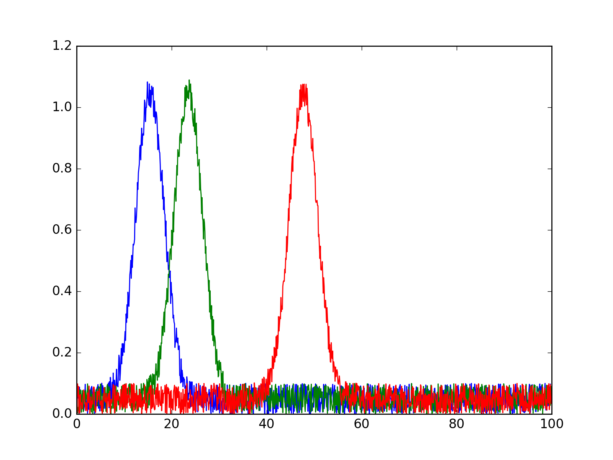

# rinobot-line-plot

Makes a simple line plot of xy or xyyy data.

So if your data has many columns, this package will take  the
first column as the x axis, and each subsequent column as
different y plots.

## Installation

Just download the zip of the package and unzip into your `rinobot-packages` folder.

> [Download rinobot-line-plot.zip](https://github.com/rinocloud/rinobot-line-plot/archive/master.zip)

- On Windows your `rinobot-packages` folder is in `My Documents`.
- On Mac your `rinobot-packages` folder is in `Documents`.

## Examples

### XY

If your data looks like

```
0.0 8.7
1.4 2.4
2.4 2.3
3.3 3.5
4.1 7.3
...
...
```

If will generate a graph like


### XYYY

If your data looks like

```
0.0 8.7 4.5 6.4 7.7
1.4 2.4 3.4 5.6 7.6
2.4 2.3 2.2 4.6 2.2
3.3 3.5 7.3 1.7 6.3
4.1 7.3 5.6 6.7 9.8
...
```

If will generate a graph like


