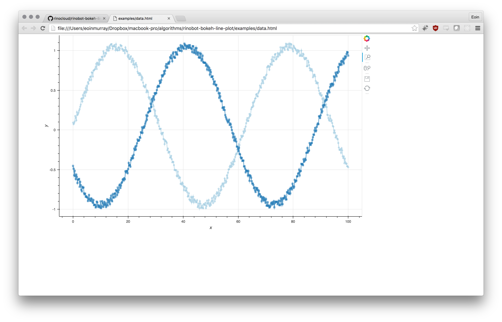

# rinobot-interactive-line-plot

Makes an interactive line plot of xy or xyyy data.

So if your data has many columns, this package will take  the
first column as the x axis, and each subsequent column as
different y plots.

## Installation

Just download the zip of the package and unzip into your `rinobot-packages` folder.

> [Download rinobot-interactive-line-plot.zip](https://github.com/rinocloud/rinobot-interactive-line-plot/archive/master.zip)

- On Windows your `rinobot-packages` folder is in `My Documents`.
- On Mac your `rinobot-packages` folder is in `Documents`.

## Examples

> [Live example link](https://rawgit.com/rinocloud/rinobot-plugin-interactive-line-plot/master/examples/data.html)

If your data looks like

```
0.0 8.7
1.4 2.4
2.4 2.3
3.3 3.5
4.1 7.3
...
...
```

If will make an interactive html graph like:


